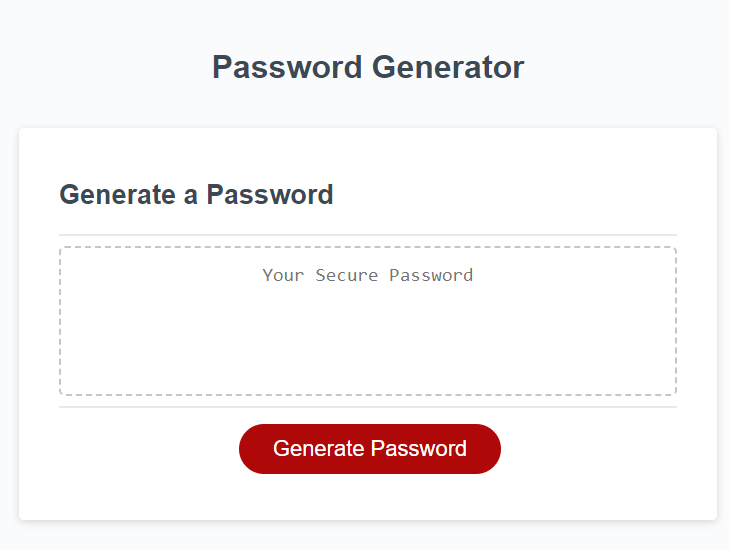

# Password Generator

<https://geminiad.github.io/password-generator>

------------------------------------------------

<a href="#description">Description</a> •
<a href="#key-features">Key Features</a> •
<a href="#usage">Usage</a> •
<a href="#technologies-used">Technologies Used</a> •
<a href="#credits">Credits</a> •
<a href="#author">Author</a>

## Description

It's a website with a button and a text area. When you hit the button, a random password meeting certain criteria is generated and displayed in the text area.

## Key Features

Generate a password at the click of a button! Boasts a responsive design: it looks good on a desktop, tablet, or smartphone.

## Usage

Navigate to:   
<https://geminiad.github.io/password-generator>

When the "Generate Password" button is hit, the user must specify a length of no less than 8 and no more than 128 for the password. If the length is outside of those bounds or invalid, or the user presses "Cancel", the application will complain and quit. The user will also be asked if they wish to include upper case characters, lower case characters, numeric characters, and special characters. The user must choose at least one of these options or the application will complain and quit.

## Technologies Used

- HTML
- CSS
- JavaScript

## Credits

<https://www.programiz.com/javascript/examples/generate-random-strings#:~:text=random()%20method%20is%20used,a%20random%20character%20is%20generated.>
for generating a random character from a String example.

<https://owasp.org/www-community/password-special-characters>
for a list of special characters.

## Author

Adam Ferro
- [Github](https://github.com/GeminiAd)
- [Linked-In](https://www.linkedin.com/in/adam-ferro)